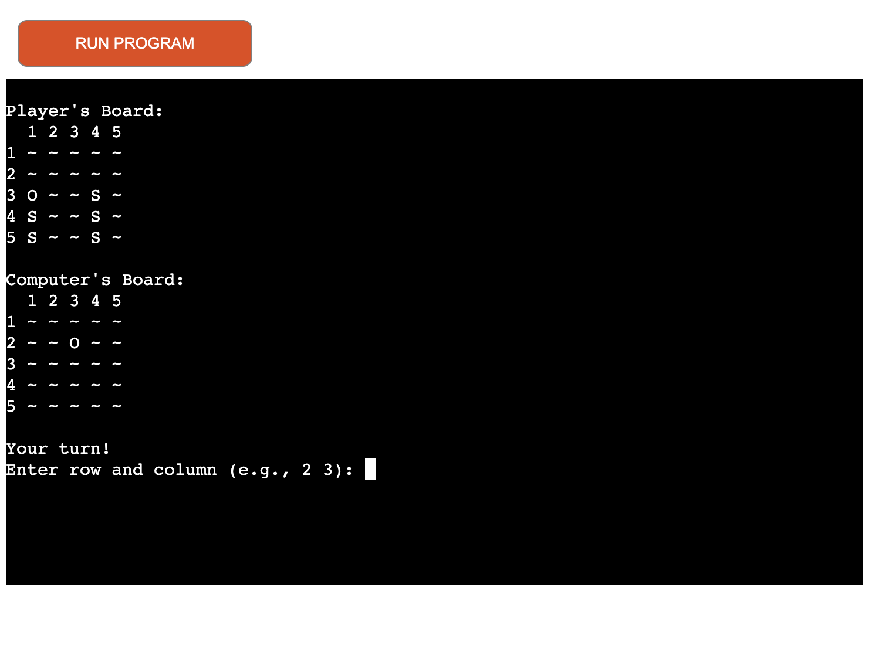
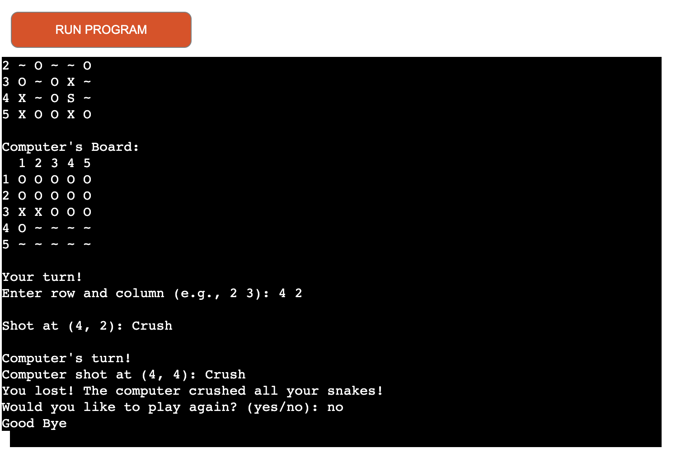
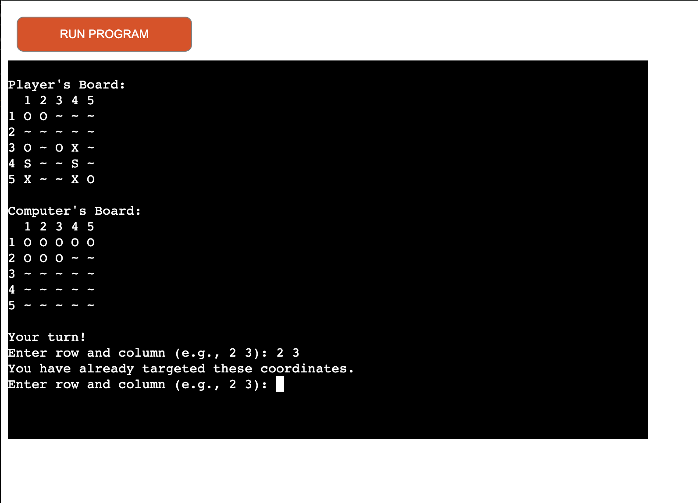
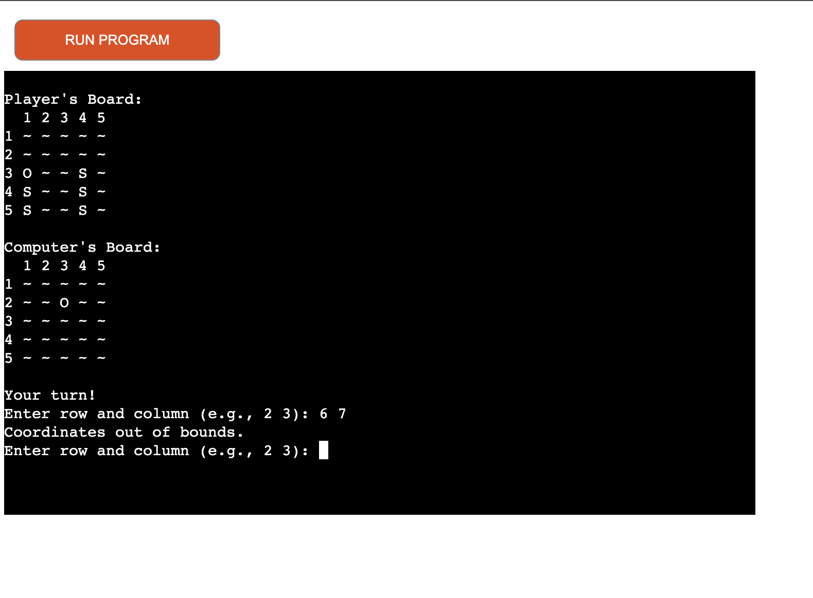
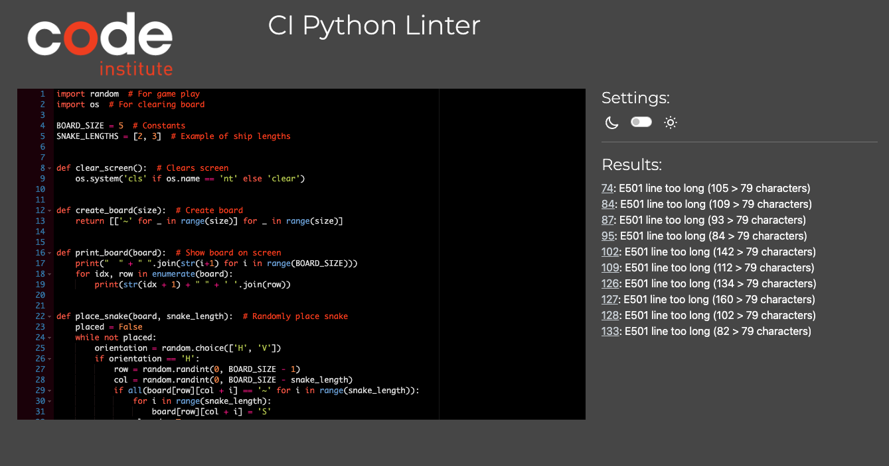

# The Snake Pit

* This is a straightforward Python terminal-based game. Taking inspiration from a five-point grid-based game, similar to something like BattleShips.
* You play the game crushing the snakes that the opposition has placed in their board.
* This means that you will try and guess where the code computer has placed their randomized points snakes on a 5x5 gird board which you, as the user, cannot see. 

## How To Play 

1. Guess where the computer has their snakes placed on their board.
2. The rows are labeled 1 through 5 
3. Type in two spaced-out digits e.g.: "2 3". 
4. See if you were able to guess correctly and have crushed the computer snakes
5. Repeat until a winner is declared!

## Features 

This is based on the popular Battle Ships game, but with an added twist. Here are a few images for you to get a feel of the game.

###  Features - Existing Features

 - Randomly generated board.
 - The board is a 5 by 5 grid.
 - The user cannot see where the computer has generated the position of their snakes (obviously, as it would not be much fun otherwise).

 

* The user plays against the computer.
* The Python code therefore accepts data input from the user.
* The computer also keeps track of the scores.
* It will not let you enter the same data twice. 
* It will not let you enter erroneous data, outside the digits of 1 through 5 and the word 'yes' or 'no'. 

###  Features - Future Features 

* The board could be extended to bigger than it currently is. 
* Allow the user to decide where they place their snakes. 

## Testing 

I used the manual testing methods for checking my code: 

- PEP8 
- Feeding it invalid data, outside the previosly stated bounds, to see how it responds. 
- Use my local terminal in my IDE
- Deploying via Heroku to see the final product 

### Bugs detected

- I previously tried to add a command that I had forgotten to define, therefore sending back an error.
- PEP8 informed of many indentation errors, most of which were resolved, and easy to do so. 

### Bugs resolved 

- Made sure I had all required "def" portions of the code, so that when they are called they would respond.
- Fixed the indent errors found when I ran it through PEP8. 

### Bugs not resolved 

- PEP8 stated several lines are too long, but these are due to the comments I had to make about the code and the instructions which are printed and are not actually code, they do not interfere with the over all product or its delivery. 

## Deployment 

1. Go to Heroku dash-board 
2. Click on 'Create a new Heroku app'
3. Set the build packs to Python and NodeJS in that order
4. Link your GitHub repo to Heroku app 
5. Click on Deploy!

## Credits 

I used materials for writing game code from online sources such as: 
* Code Institute - Specifically for the inuital conecpt of a Battle Ship based game 
* Geeks For Geeks 
* Stack Overflow - Specifically for "# Game play and print instructions loop"
* Code Review Stack Exchange  
* Tutorials Point 